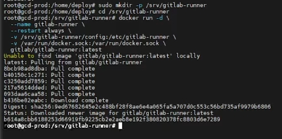
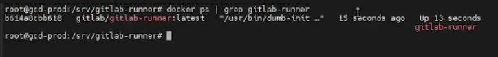



📺 **Assista no YouTube:** [Link da videoaula](https://youtu.be/PtsZcDvk2tQ)

# Comandos da videoaula

## Instalar o GitLab Runner  na VPS (Docker executor) Linux Ubuntu
### Criar diretório padrão

Primeiro você cria a pasta:
```
sudo mkdir -p /srv/gitlab-runner
```
Depois você entra na pasta:
```
cd /srv/gitlab-runner
```

Agora execute esse comando para criar e iniciar um novo contêiner do GitLab Runner.
```
docker run -d \
  --name gitlab-runner \
  --restart always \
  -v /srv/gitlab-runner/config:/etc/gitlab-runner \
  -v /var/run/docker.sock:/var/run/docker.sock \
  gitlab/gitlab-runner:latest
```
Imagem após executar o comando.




### Detalhes do comando

+ `docker run`: Diz ao Docker para criar e iniciar um novo contêiner.
+ `-d (detached)`: Roda o contêiner em segundo plano (em modo "background"), liberando o seu terminal para continuar sendo usado.
+ `--name gitlab-runner`: Dá um nome amigável ao contêiner (gitlab-runner), facilitando na hora de dar comandos como docker stop gitlab-runner ou docker logs gitlab-runner.
+ `--restart always`: Define a política de reinicialização. Se o contêiner cair por algum erro ou se o próprio serviço do Docker/servidor for reiniciado, o Docker subirá o GitLab Runner automaticamente de novo.
+ `-v /srv/gitlab-runner/config:/etc/gitlab-runner`: Cria um volume montado. Ele vincula a pasta /srv/gitlab-runner/config da sua máquina real (host) à pasta /etc/gitlab-runner dentro do contêiner. É aqui que fica o arquivo config.toml, garantindo que as configurações do seu Runner não sumam se o contêiner for deletado.
+ `-v /var/run/docker.sock:/var/run/docker.sock`: Este é um ponto chave. Ele compartilha o "soquete" do Docker da sua máquina real com o contêiner. Isso permite que o GitLab Runner crie e gerencie outros contêineres Docker (essencial se você usa o executor do tipo docker para rodar seus testes e builds isolados).
+ `gitlab/gitlab-runner:latest`: Indica a imagem oficial do GitLab Runner que será baixada e executada, usando a versão mais recente disponível (latest).

> bind do docker.sock é obrigatório para o executor Docker controlar containers.

### Verificar se o Runner está rodando
```
docker ps | grep gitlab-runner
```
Imagem deve ser parecida com essa abaixo. O que importar é a úlima informação __Up 13 seconds__ (está online a 13 segundos).



## Registrar Runner na VPS Linux

### Execute o comando abaixo para registrar um Runner

O comando abaixo inicia o registro do Runner na VPS
```
docker exec -it gitlab-runner gitlab-runner register
```
Depois irá pedir as informações abaixo:

```
GitLab instance URL:
https://gitlab.com/

Registration token:
COLE_O_TOKEN_AQUI

Description:
bweb-prod-runner

Tags:
deploy,prod

Executor:
docker

Docker image:
docker:27
```
### Reiniciar
Execute o comando a seguir para reiniciar o GitLab Runner
```
docker restart gitlab-runner
```

# Arquivo com as configurações dos Runners

Caso queira ver se o registro funcionou, pode olhar o arquivo **config.toml** com o comando a seguir, você abre o arquivo:
```
sudo nano /srv/gitlab-runner/config/config.toml
```
Deve aparecer uma tela como esta abaixo. Para sair, basta clicar em **Ctrl** + **X**.
```
concurrent = 1
check_interval = 0
connection_max_age = "15m0s"
shutdown_timeout = 0

[session_server]
  session_timeout = 1800

[[runners]]
  name = "bweb-prod-runner"
  url = "https://gitlab.com/"
  id = 53771940
  token = "TOKEN_QUE_VOCE_INFORMOU"
  token_obtained_at = 2026-06-19T03:06:52Z
  token_expires_at = 0001-01-01T00:00:00Z
  executor = "docker"
  [runners.cache]
    MaxUploadedArchiveSize = 0
    [runners.cache.s3]
      AssumeRoleMaxConcurrency = 0
    [runners.cache.gcs]
    [runners.cache.azure]
  [runners.docker]
    tls_verify = false
    image = "docker:27"
    privileged = false
    disable_entrypoint_overwrite = false
    oom_kill_disable = false
    disable_cache = false
    volumes = ["/var/run/docker.sock:/var/run/docker.sock", "/cache"]
    volume_keep = false
    shm_size = 2000000000
    network_mtu = 0
```

[](https://youtu.be/PtsZcDvk2tQ)

---

## 👨‍💻 Autor

**Luciano Dória**  
*Engenheiro de Software | Arquitetura, Tooling, DevOps e IA aplicada (.NET)*

No que posso ajudar? Entre em contato ou acompanhe meu trabalho:

[](https://www.linkedin.com/in/lucianodoriadf/)
[](https://github.com/lucianodoria)
[](https://www.youtube.com/@lucianodoria)
[](https://www.instagram.com/luciano.doriati/)

---